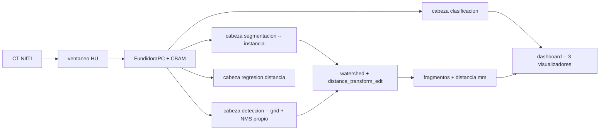

# 🦴 PENGWIN · Deteccion → Segmentacion → Medicion → Dashboard

[](https://www.python.org/)
[](https://pytorch.org/)
[](https://scikit-image.org/)
[](https://plotly.com/)
[](#-alcance-y-advertencia)

**PENGWIN** es un sistema propio de deteccion, segmentacion de instancia y medicion de fracturas pelvicas sobre tomografia computarizada: localiza cada region osea pelvica en un corte CT, segmenta y clasifica los fragmentos individuales por hueso, mide la distancia de separacion de cada fragmento conminuto en milimetros, y lo integra todo en un dashboard con 3 visualizadores y demo en vivo — en vez de depender de un framework de deteccion/segmentacion ya entrenado.

> Dataset: **PENGWIN Task 1 (CT)** via [Zenodo](https://doi.org/10.5281/zenodo.10927452), MICCAI 2024. 150 escaneos, mascaras de fragmentos validadas por ortopedistas.
> **Proyecto integrador Corte 2** — Analitica de Datos, modulo IA (Carlos Andres Ferro), UAO, 2026-2.

---

## 🎯 Direccion del proyecto

Este proyecto no se apoya en YOLO, Detectron2 ni Mask R-CNN preentrenado — es una decision explicita del enunciado, no una limitacion de tiempo: el valor esta en entender e implementar cada pieza del pipeline (grid de deteccion, NMS, atencion, separacion de instancia) en vez de invocar una libreria de alto nivel.

- ✅ **Backbone propio** (`FundidoraPC` extendida) + **CBAM** — atencion de canal y espacial antes de bifurcar.
- ✅ **4 cabezas sobre un mismo backbone** — clasificacion anatomica, deteccion (grid + NMS propio), segmentacion de instancia, regresion de distancia en mm.
- ✅ **Post-proceso propio** — watershed guiado por `distance_transform_edt`, reutilizado tanto para separar fragmentos en contacto como para medir la distancia clinica.
- ✅ **SAM solo como baseline de comparacion** (zero-shot), nunca en el pipeline final.
- ✅ **Dashboard con 3 visualizadores** — MIP raw, inferencia corte-a-corte, reconstruccion 3D — con demo desplegado via tunel de Cloudflare.

## 🏗️ Arquitectura

```
src/
├── data/          carga NIfTI, ventaneo HU, splits, EDA de calidad de imagen
├── models/        FundidoraPC extendida, CBAM, las 4 cabezas
├── losses/        perdida compuesta multitarea (λ calibrados y justificados)
├── postprocess/   NMS propio, watershed + distance_transform_edt
├── eval/          IoU, Dice, mAP, HD95, ASSD, latencia GPU/CPU
└── dashboard/      los 3 visualizadores (MIP raw, inferencia corte-a-corte, reconstruccion 3D)

notebooks/         EDA y experimentos exploratorios
scripts/           entrenamiento, evaluacion, despliegue
checkpoints/        pesos entrenados (.pth) — no versionados, ver .gitignore
docs/               model card, plan del proyecto, bitacora de decisiones
```



---

## ⚙️ Instalacion y ejecucion

### 1. Entorno

```bash
git clone https://github.com/ShadowBlack33/Proyecto-2-Analitica-de-Datos.git
cd Proyecto-2-Analitica-de-Datos

python -m venv .venv
source .venv/bin/activate        # Windows: .venv\Scripts\activate

pip install -r requirements.txt
```

> PC con menos de 6GB de VRAM: `torch.cuda.amp` ya viene activado por defecto en `scripts/train.py`. Si aun asi no alcanza, bajar el batch o activar gradient accumulation (ver `configs/`).

### 2. Entrenamiento

```bash
python scripts/train.py --config configs/default.yaml
```

Semillas fijas, curriculum por etapas (deteccion → segmentacion → regresion de distancia → fine-tuning conjunto) — comandos exactos de cada etapa en `scripts/`.

### 3. Dashboard

```bash
python src/dashboard/app.py
```

Se expone localmente y, para la demo en vivo, via tunel de Cloudflare (ver `docs/`).

---

## 🖥️ Dashboard: 3 visualizadores obligatorios

| Visualizador | Contenido | Metodo |
|---|---|---|
| **1. Volumen crudo (raw)** | MIP mostrando solo el hueso | Umbral de intensidad en HU sobre el volumen sin procesar — sin modelo |
| **2. Inferencia corte por corte** | Deteccion + segmentacion + clasificacion, con slider | Overlay 2D de bboxes y mascaras coloreadas por corte |
| **3. Reconstruccion 3D final** | Fragmentos coloreados por macro-hueso, distancia visible junto a cada etiqueta | Apilamiento de mascaras + marching cubes (skimage) + Plotly Mesh3d |

La distancia de separacion se muestra directamente en los visualizadores 2 y 3 — no solo en una tabla.

---

## 🧾 Configuracion

### `configs/default.yaml`

```yaml
resolution: 256
batch_size: 8
amp: true
grid_size: 16
lambda_cls: 1.0
lambda_box: 5.0
lambda_seg: 1.0
lambda_dist: 1.0
seed: 42
voxel_spacing_source: "nifti_header"
```

---

## 🔁 Reproducibilidad

- Semillas fijas (`seed: 42`) propagadas a PyTorch, NumPy y los splits del dataset.
- Checkpoints `.pth` versionados fuera de git (ver `.gitignore`), documentados en cada model card.
- `IA_USAGE.md` con cada prompt, decision obtenida y modificacion manual posterior.
- Estudio de ablacion obligatorio: con/sin CBAM, con/sin transfer learning en el backbone.

---

## 🛠️ Troubleshooting

| Problema | Sugerencia |
|---|---|
| `CUDA out of memory` | Bajar batch a 4-8, confirmar `amp: true`, o activar gradient accumulation |
| Fragmentos en contacto se fusionan en la mascara | Revisar el watershed en `src/postprocess/` — documentado como limitacion conocida en el model card |
| Distancia sale rara (muy grande o negativa) | Confirmar que se esta usando el spacing del header NIfTI, no pixeles crudos |
| Dashboard sin datos | Confirmar que `scripts/train.py` corrio completo y `checkpoints/` tiene pesos |
| Tunel de Cloudflare no conecta en la sustentacion | Usar el video pregrabado de respaldo (ver `docs/`) |

---

## ⚠️ Alcance y advertencia

Este sistema tiene **fines exclusivamente academicos**. No es un dispositivo medico, no ha sido validado clinicamente y no debe usarse para apoyar decisiones quirurgicas reales.

## 📜 Licencia

Uso academico — Proyecto integrador Corte 2, Analitica de Datos, UAO 2026-2.

## 👥 Equipo

**Carlos Andres Orozco Caicedo** — Data Engineer & AI Engineer · Colombia 🇨🇴

**Jose David Mesa Ramirez** — Data Engineer & AI Engineer · Colombia 🇨🇴

**Sara Lucia Rojas Mejia** — Data Engineer & AI Engineer · Colombia 🇨🇴

**Esteban Cobo Gomez** — Data Engineer & AI Engineer · Colombia 🇨🇴
